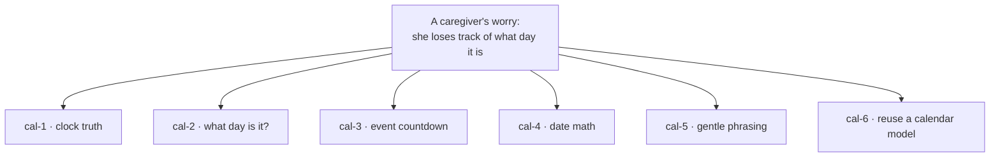
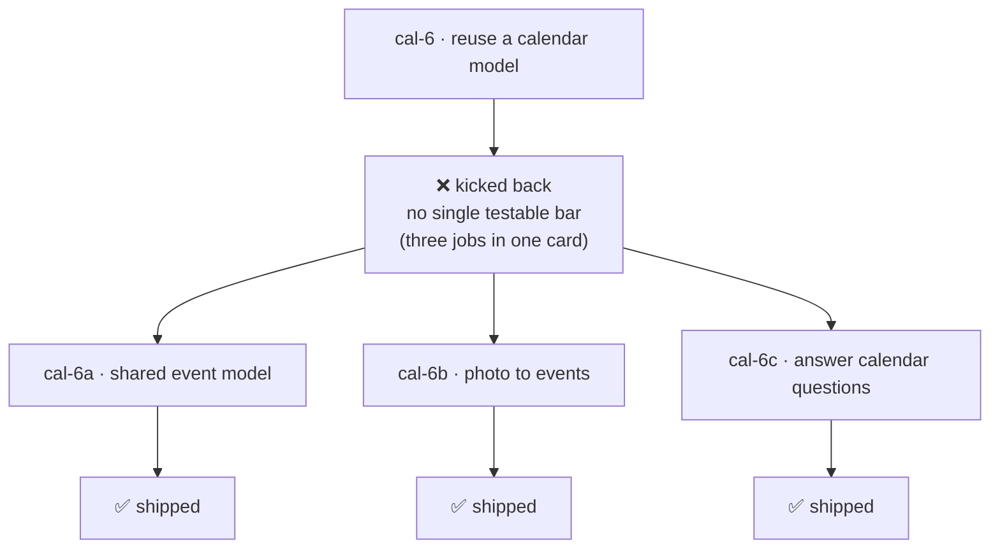
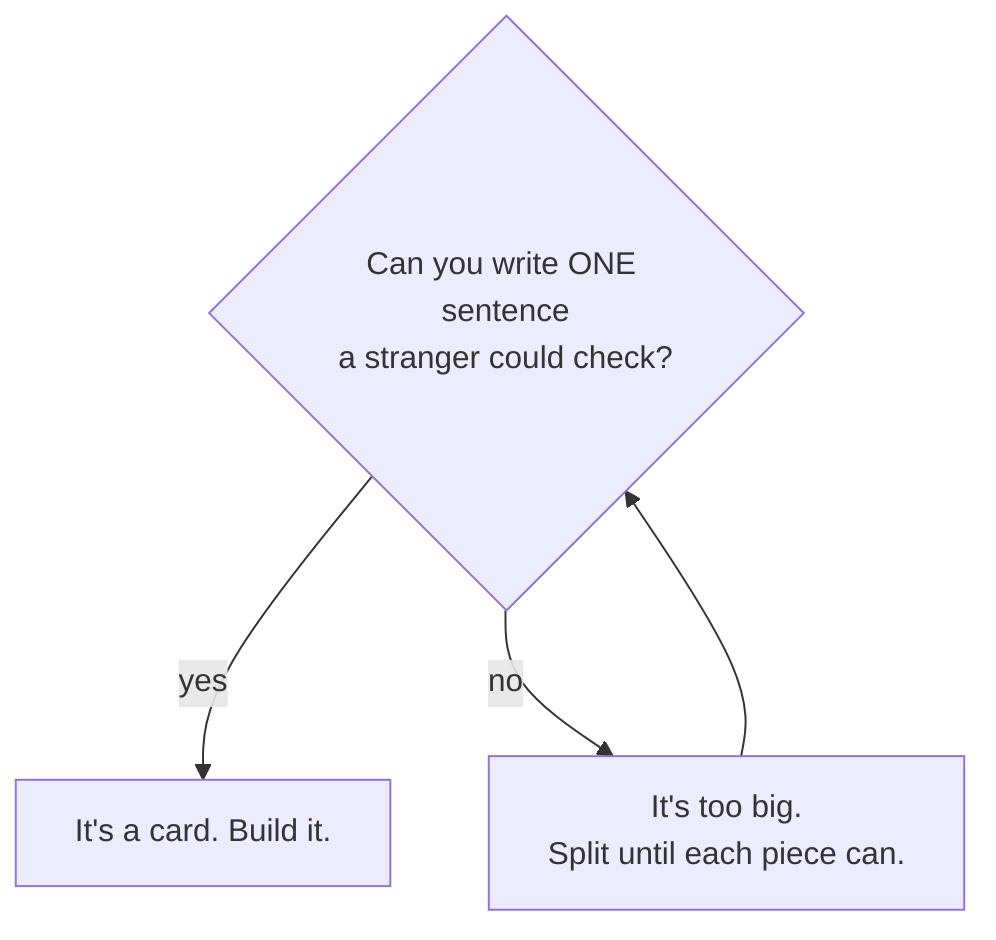
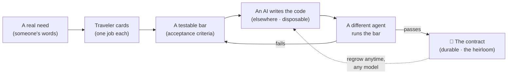

# From a Need to a Contract

> *A worked example: building a memory companion's sense of time, starting from one caregiver's words — and the card that got kicked back.*

Most "how it works" docs show you the happy path: a clean idea, a clean build, a clean finish.
Real work isn't like that. So here is a real one — the actual story of how we built the calendar
sense for a companion that lives in someone's home. Names removed; everything else is exactly how
it happened. **Eight recipe cards. One of them failed first. That failure is the whole point.**

---

## 1. The need — a real person, real words

It didn't start with a spec. It started with a caregiver, worried out loud: *the person they care
for — an elder who is slowly losing words and time — kept getting anxious about what day it was, and
when the visit was coming.*

That's the raw material. Not "build a calendar feature." A **worry.** Fuzzy, human, and far too big
to hand to a machine as-is. If you asked an AI to "help her keep track of time," you'd get something
that demos well and breaks the moment it matters — because there's nothing in that sentence anyone
can actually *check.*

So the first move is not to build. It's to **break the worry into pieces small enough to test.**

---

## 2. Turn the worry into cards

We split it into six small jobs. Each one does **a single thing**, and — this is the rule — each one
comes with a way to **know it worked.** We call these recipe cards (they're the same cards this whole
cookbook is made of).

| Card | The one job | How you'd know it works |
|---|---|---|
| **cal-1** | Clock truth | The device clock is time-synced; if it's ever wrong, the companion *refuses* to answer the time rather than say something false. |
| **cal-2** | "What day is it?" | Answers correctly and *warmly* — and gives the **same** kind answer on the tenth ask as the first, with no trace of impatience. |
| **cal-3** | Event countdown | An event told **once** is written down and read back to confirm; "how many days until the party?" counts down correctly, day after day. |
| **cal-4** | Date math | "How long until her birthday?" is right even across the New Year — a January date asked about in December. |
| **cal-5** | Gentle phrasing | Says *"in two days"* or *"something's coming up,"* not raw calendar dates — softer on a mind that finds numbers hard. |
| **cal-6** | Reuse an existing calendar | A sister device in the family already had a calendar model; reuse it instead of inventing a new one. |

Notice the right-hand column. **That's the part that makes this work.** Every card carries a
*testable bar* — a sentence a stranger could check without trusting our word for it. A card without
that bar isn't a card yet. Hold onto that; in a minute it saves us.

---

## 3. Build each card — and the builder is never the judge

Now we hand a card to an AI and say: *build this, and the bar is your test.* The AI writes the code
(in its own project — **never in this cookbook**; this repo holds only the cards). Then — and this is
load-bearing — a **different** agent runs the bar. The one who built it doesn't get to grade it.

Five cards went straight through. Clock truth, what-day-is-it, the countdown, the date math, the
gentle phrasing — each built, each checked by another set of eyes, each **shipped.**

And then there was the sixth.

---

## 4. The card that got kicked back

**cal-6 failed.** It went out, came back rejected, and was set aside.

Here's the part that matters: *it didn't fail because the AI was dumb.* It failed because the **card
was wrong.** "Reuse the existing calendar" sounds like one job, but it was secretly **three** wearing
one coat:

- a place to **store** events,
- a way to **read** events off a photo of a hand-drawn calendar,
- and a way to **answer questions** about those events.

The tell was simple, and it's the same tell every time: **we couldn't write one sentence a stranger
could check.** No single bar. When you can't name the one test, the card is too big.

So we didn't push harder. We **split it** — into three cards, each with its own bar:

- **cal-6a** — the shared event model (add an event, list them, find what's on a given day).
- **cal-6b** — the photo→events reader (a picture of a calendar becomes real events).
- **cal-6c** — the gentle Q&A (answer "what's on today?" — naming the day's events, or a kind *"nothing today"*).

All three built. All three checked by a different agent. **All three shipped.**

**This is the method working, not failing.** A too-big task got caught *cheaply* — it cost one
kickback, not a tangled feature shipped into a vulnerable person's home. The bar is what caught it.

That judgment — *"is this one job, or three?"* — is the one piece of real thinking the whole system
turns on. You can teach it in a single picture:

---

## 5. The durable thing is the contract — not the code

Here's the quiet payoff. The code we wrote for all eight cards could vanish tonight, and we'd lose
almost nothing. Because the durable artifact was never the code — **it's the card.** The recipe, the
bar, the rule about refusing a wrong time. Hand those same eight cards to a smarter model next year
and it writes *better* code than we could — and the *same bars* prove it's right.

The recipe is the heirloom. The code is the crop: grown fresh, eaten, regrown next season from the
same seed.

The loop is the whole thing: **need → cards → bars → build → check → contract.** When something
fails, you don't fall off the path — you fall *back to the bar* and try again, or split the card.

---

## Why this is better — and when to use it

**Why it beat the traditional way, right here in this example:**

- **It caught the failure cheaply.** Traditional coding would have let "reuse the calendar" sprawl
  into a half-working tangle you discover *after* it's in someone's home. The bar caught it at the
  card stage — a kickback, not a disaster.
- **The contract outlives the code *and* the model.** The cards don't care which AI is fashionable.
  A better model rebuilds from them; the bars still judge. Your work doesn't rot when the tools change.
- **A non-programmer can drive it.** The artifact is plain language plus a checkable bar — not a wall
  of syntax. You can read a card, judge it, split it, approve it, without writing a line.
- **Honesty is built into the structure, not hoped for.** cal-1's bar *forbids* asserting a wrong
  time. A vulnerable person can't be told the wrong day, because the card won't pass if it could be.
  That's a guarantee you can't get from "we'll be careful."

**When to reach for it:** when the thing has to be *correct* and not just plausible · when it has to
*outlast* this year's model · when a non-coder needs to direct the build · when many devices have to
stay consistent with each other.

**When not to bother:** a one-off throwaway — a script you'll run once and delete. Don't write a
contract for that; just have the AI write the thing and move on. The discipline here pays off only
when the work has to **endure or be trusted.** A companion in an elder's home is exactly that.

---

## The pattern, in one breath

> **Need → cards → bars → build → check → contract.**
> And if a card has no bar, it isn't a card yet — split it until each piece does.

That's the entire method, learned from one caregiver's worry and one card that had to fail first.
